# Credit_Risk_Analysis

## Overview

In this project we are going to use the credit card credit dataset from LendingClub, a peer-to-peer lending services company, to do the following:
  - Oversample the data using the RandomOverSampler and SMOTE algorithms
  - Undersample the data using the ClusterCentroids algorithm
  - Then use a combinatorial approach of over- and undersampling using the SMOTEENN algorithm

Then we will compare two new machine learning models that reduce bias, to predict credit risk
  - BalancedRandomForestClassifier
  - EasyEnsembleClassifier
  
Then we will evaluate the performance of these models and make a written recommendation on whether they should be used to predict credit risk or not.

## Resources
  - Data Source: LoanStats_2019Q1.csv
  - Software: anaconda3, python 3.7.7, jupyter notebook

## Results
Using bulleted lists, describe the balanced accuracy scores and the precision and recall scores of all six machine learning models. Use screenshots of your outputs to support your results.

### Naive Random Oversampling
  - Accuracy
    - 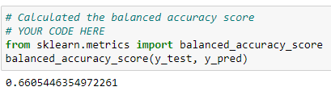
    
  - Precision and Recall values
    - 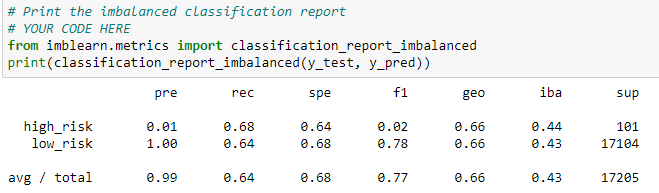
    
  Accuracy of this model is 66.05% and Precision and Recall for high risk are 1% and 68%, these are low values for making good decisions.
  
  
### SMOTE Oversampling
  - Accuracy
    - 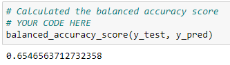
    
  - Precision and Recall values
    - 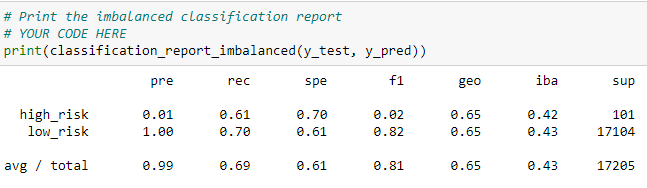
    
  Accuracy of this model is 65.46% and Precision and Recall for high risk are 1% and 61%, these are low values for making good decisions.
  
  
### ClusterCentroids Undersampling
  - Accuracy
    - 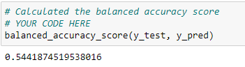
    
  - Precision and Recall values
    - 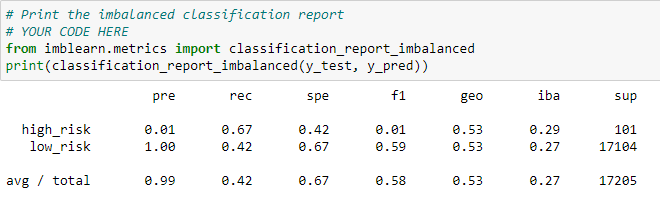
    
  Accuracy of this model is 54.42% and Precision and Recall for high risk are 1% and 67%, these are low values for making good decisions.
  
  
### SMOTEEEN Over Under sampling
  - Accuracy
    - 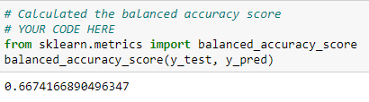
    
  - Precision and Recall values
    - 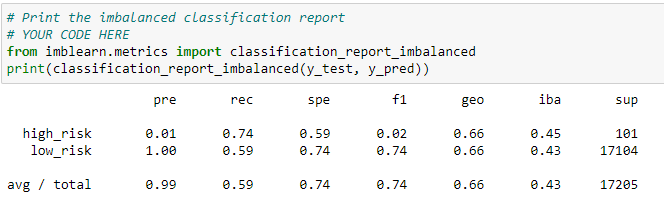
    
  Accuracy of this model is 66.74% and Precision and Recall for high risk are 1% and 74%, these are better values than the previous models but not good for making good decisions.
  
  
### Balanced Random Forest Classifier
  - Accuracy
    - 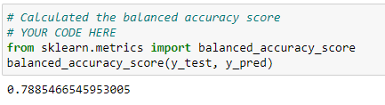
    
  - Precision and Recall values
    - 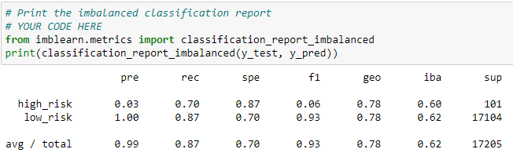
    
  Accuracy of this model is 78.85% and Precision and Recall for high risk are 3% and 70%, these are considerably better values than the previous models might be used for making good decisions.
  
  
### Easy Ensemble AdaBoost Classifier
  - Accuracy
    - 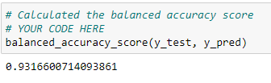
    
  - Precision and Recall values
    - 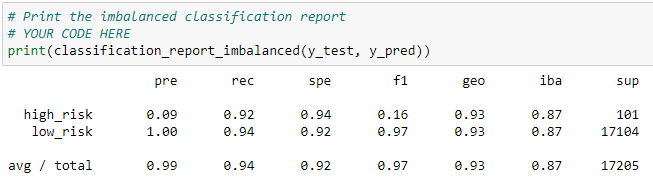
  
  Accuracy of this model is 93.17% and Precision and Recall for high risk are 9% and 92%, these are best values of all the models above for making good decisions.
  
  
## Summary

 Model name | Accuracy | Precision | Recall
 -----------|----------|-----------|-------
  Naive Random Oversampling | 66.05% | 1% | 68%
  SMOTE Oversampling | 65.46% | 1% | 61%
  ClusterCentroids Undersampling | 54.42% | 1% | 67%
  SMOTEEEN Over Under sampling | 66.74% | 1% | 74%
  Balanced Random Forest Classifier | 78.85% | 3% | 70%
  Easy Ensemble AdaBoost Classifier | 93.17% | 9% | 92%

Based on the information shown in the table above, we recommend the Easy Ensemble AdaBoost Classifier model as a better predictor of high risk and low risk loan applicants.

